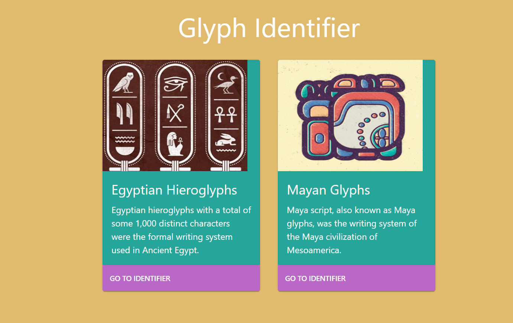

# Hieroglyph Image Classifier

Image classifier project that combines React frontend (TypeScript, Material-UI) with a Flask(Python) backend that allows the user to upload and identify a hieroglyph. The predictive model was built byusing Python and TensorFlow.

This repository contains the files related to the frontend app. Backend source code can be found [here](https://github.com/XandraV/hieroglyp-image-classifier/tree/master/app/backend/).

## Installation

Clone the master branch and then run the following scripts in the project directory:

* `npm install` - to install relevant dependencies

* `npm start` - start the app

## Resources

| Description | Link     |
| :------------- | :------------- |
| Material-UI components - a popular React UI framework       | [Material-UI docs](https://material-ui.com/getting-started/installation/) |
| Library that utilises tagged template literals to style components  | [styled components](https://styled-components.com/) |

## Created with create-react-app

This app was created with [create-react-app](https://github.com/facebook/create-react-app), see usage guidelines in [create-react-app-readme.md](create-react-app-readme.md)